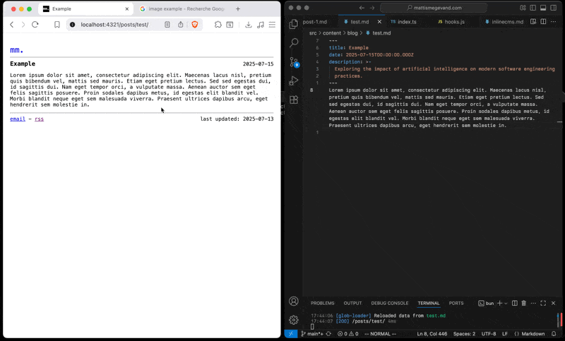

# inlinecms

Astro integration that enables inline editing for Markdown-based content.

## demo



## installation

```bash
npm install inlinecms
```

With bun:

```bash
bun add inlinecms
```

## usage

Add the integration to your `astro.config.mjs` file:

```ts
import inlineCMS from "inlinecms";

export default {
  integrations: [inlineCMS()],
};
```

When running `astro dev` the integration injects a small client script to make content editable and saves changes back to your project.

## development

Install dependencies and build the library:

```bash
bun install
bun run build
```
